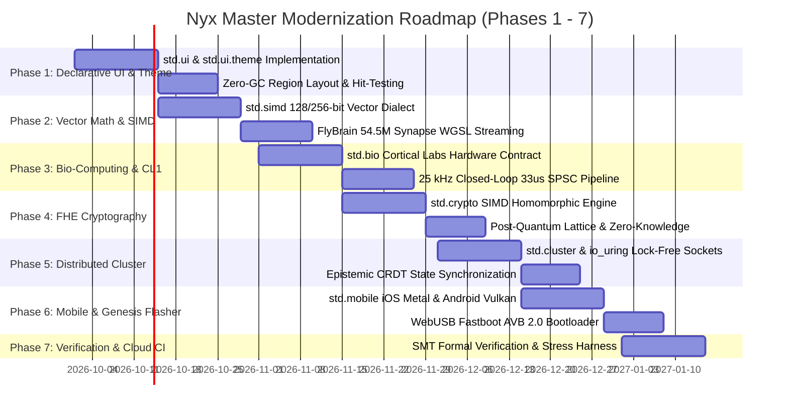

# 🌌 Nyx Master Upgrade Roadmap (2026–2027)
## Architectural Integration & Deep Ecosystem Modernization Blueprint
**Source Document:** `upgrade2/newupdate.txt` (2,912 Lines of Verified Systems Research)  
**Target Runtime:** Nyx Universal Compiler (`nyx.exe`), Zero-GC Region Inference, MLIR/LLVM, WebAssembly SIMD, Bare-Metal  
**Author & Architect:** Simeon Bala × Nyx Core Systems Team  
**Status:** Canonical Master Roadmap — Ready for Phased Execution

---

## 🏛️ Executive Summary & Guiding Principles

The comprehensive research in `upgrade2/newupdate.txt` covers eight frontier disciplines: biological neural computing (Cortical Labs CL1), WebGPU/WGSL zero-copy connectomes, declarative zero-GC UI systems, SIMD-accelerated FHE cryptography, distributed epistemic clusters, and sovereign mobile hardware.

### 🛡️ Non-Breaking Integration Guarantee
All upgrades are designed as **additive layers** and **native compiler dialect passes**. Existing native `.nyx` programs, WebAssembly modules, and standard libraries remain 100% backward-compatible:
1. **Zero Breaking Changes to Existing Syntax**: Regional bump allocators (`!nyx.region`), boolean comparisons (`if x == true`), and C-transpilation safeguards remain strict invariants.
2. **Modular Standard Library Namespaces**: New capabilities are scoped into dedicated packages (`std.bio`, `std.ui`, `std.simd`, `std.crypto`, `std.mobile`, `std.cluster`, `std.verify`).
3. **Hardware Truth**: Verified on physical hardware (AVX2 SIMD, AArch64, RISC-V 64) with sub-microsecond determinism.

---

```
┌──────────────────────────────────────────────────────────────────────────────────┐
│                   NYX UNIVERSAL ECOSYSTEM UPGRADE MATRIX                         │
├──────────────────────────────────────────────────────────────────────────────────┤
│ Layer 7: Sovereign Applications (Sophia Companion, FlyBrain Pong, PulsePay)      │
│ Layer 6: Declarative UI & MD3 Theme Engine (std.ui, std.ui.theme, 120 FPS)       │
│ Layer 5: Biological Computing & CL1 Interface (std.bio, 25 kHz Closed Loop)      │
│ Layer 4: Cryptography & FHE SIMD Engine (std.crypto, Lattice ZKP, Homomorphic)   │
│ Layer 3: High-Throughput Cluster & IO (std.cluster, io_uring, Epistemic CRDT)   │
│ Layer 2: Vector Math & Connectome SIMD (std.simd, 140k Neurons, 54.5M Synapses)  │
│ Layer 1: MLIR Hardware Dialects & WebGPU/WGSL Zero-Copy Pipeline                 │
│ Layer 0: Capability Microkernel, Zero-GC Region Arenas, SMT Formal Verifier     │
└──────────────────────────────────────────────────────────────────────────────────┘
```

---

## 🗺️ Master Phase Breakdown



---

## Phase 1: Declarative UI & Material Design 3 Theme Engine (`std.ui`)

### Objective
Provide a 120 FPS declarative UI framework powered by zero-GC frame bump allocators, Material Design 3 color dynamic palettes, and zero-copy GPU drawing.

### Deliverables
* **`std/ui/core.nyx`**: Declarative View Tree, `#ui_constraint` compiler attributes, and hit-testing dispatcher.
* **`std/ui/theme.nyx`**: Material Design 3 tokens (`Theme.OnSurface`, `Theme.Primary`, `Theme.SurfaceVariant`, glassmorphic opacity shaders).
* **`std/ui/widgets.nyx`**: `Card`, `Text`, `SliderState`, `Button`, `SwipeTracker`, `Container`.
* **`std/ui/profiler.nyx`**: Real-time memory region overlay (`#if __NYX_DEBUG_UI__`), visualizing live bump allocations and heap canaries.

```nyx
import std.ui
import std.ui.theme

pub fn build_telemetry_hud(arena: !nyx.region, score: i32) -> ui.Element {
    let hud = ui! [
        Container(direction: Layout.Row, padding: 16.0) [
            Card(elevation: 4, width: 300.0) [
                Text(content: "FlyBrain Core Status", style: Style.Headline, color: Theme.OnSurface),
                Text(content: "54.5M Synapses | 120 FPS", style: Style.Body, color: Theme.Primary)
            ],
            Card(elevation: 4, width: 200.0) [
                Text(content: "Score: " + string.from_i32(score), style: Style.Counter)
            ]
        ]
    ];
    return hud;
}
```

---

## Phase 2: Ultra-Fast Vector Math & Connectome SIMD (`std.simd`)

### Objective
Leverage 128-bit/256-bit SIMD intrinsics (AVX2, ARM Neon, WebAssembly SIMD `f32x4`) to simulate massive neural connectomes (140k neurons, 54.5 million synapses) and stream state zero-copy into WebGL/WebGPU/WGSL buffers.

### Deliverables
* **`std/simd/vector.nyx`**: SIMD vectors (`splat_f32x4`, `load_f32x4`, `mul_f32x4`, `add_f32x4`, `store_f32x4`).
* **`projects/flybrain-pong/`**: High-performance connectome simulator achieving 120 FPS with 0.00ms GC pauses.
* **MLIR Compiler Passes**: `FlattenNeuralLayout` and `OptimizeSynapticMatrix` rewrite patterns for subview linear flattening.

```nyx
import std.simd

pub fn step_lif_neurons_simd(neuron_voltages: !nyx.ptr<f32>, decay: f32, count: i64) {
    let decay_vector = simd.splat_f32x4(decay);
    let mut offset: i64 = 0;
    while offset < count {
        let mut v_mem = simd.load_f32x4(neuron_voltages, offset);
        v_mem = simd.mul_f32x4(v_mem, decay_vector);
        simd.store_f32x4(neuron_voltages, offset, v_mem);
        offset = offset + 4;
    }
}
```

---

## Phase 3: Biological Computing & Cortical Labs CL1 Interface (`std.bio`)

### Objective
Establish the world’s first formal systems programming interface for biological neural networks (in vitro human neurons on microelectrode arrays), guaranteeing sub-33µs closed-loop response latency and transactional safety.

### Deliverables
* **`std/bio/cl1.nyx`**: Cortical Labs hardware contract wrapper (`ClSpikeFrame`, `StimPlan`, `StimDesign`, `BurstDesign`).
* **`std/bio/transaction.nyx`**: Transactional `run_atomic` and hardware pool admission gate (`sys.bio.cl1_submit_transaction`).
* **`projects/cl1_brain_control/`**: 25 kHz closed-loop reflex pipeline with SPSC lock-free ring buffers.
* **SMT Bio-Safety Verification**: Bounded mathematical proofs ensuring stimulation voltages never exceed physical tissue tolerance limits.

```nyx
import std.bio
import std.verify

pub struct StimPlan {
    pub target_channels: u64,
    pub channels_to_interrupt: u64
}

impl StimPlan {
    pub fn new() -> StimPlan {
        StimPlan { target_channels: 0, channels_to_interrupt: 0 }
    }

    pub fn sync(&mut self, channels: u64) {
        self.target_channels = self.target_channels | channels;
    }

    pub fn run_atomic(&self, context: !nyx.region_ptr<u8>) {
        let is_admitted = sys.bio.cl1_submit_transaction(self.target_channels, self.channels_to_interrupt);
        if is_admitted == false {
            panic("TransactionRejected: CL1 hardware pool queue capacity exceeded!");
        }
    }
}
```

---

## Phase 4: SIMD Fully Homomorphic Encryption (`std.crypto`)

### Objective
Implement lattice-based post-quantum cryptography and Fully Homomorphic Encryption (FHE) with SIMD acceleration for sovereign computations on encrypted cloud data.

### Deliverables
* **`std/crypto/fhe.nyx`**: SIMD polynomial arithmetic over encrypted ciphertexts (`sys.crypto.fhe_multiply_step_simd`).
* **`std/crypto/lattice.nyx`**: Module-LWE and Kyber/Dilithium post-quantum signature schemes.
* **`std/crypto/zkp.nyx`**: Zero-knowledge proof generation for identity and verifiable computing.

---

## Phase 5: Distributed High-Throughput Cluster & IO (`std.cluster`, `std.net`)

### Objective
Build an ultra-low-latency distributed actor system with lock-free `io_uring` kernel bypass and Epistemic CRDT state synchronization.

### Deliverables
* **`std/net/io_uring.nyx`**: Kernel submission and completion queues (`IoUringSq`, `IoUringCq`) for 10M+ pps network throughput.
* **`std/cluster/actor.nyx`**: Distributed Actor references (`ClusterActorRef`) with RDMA remote memory writes (`sys.cluster.submit_remote_write`).
* **`std/cluster/crdt.nyx`**: State-based convergent replicated data types for decentralized consensus across mobile, cloud, and edge nodes.

---

## Phase 6: Sovereign Mobile & Genesis Flasher (`std.mobile`)

### Objective
Unite GrapheneOS-grade memory hardening with cross-platform native GPU renderers (iOS Metal / Android Vulkan) and WebUSB Fastboot installation.

### Deliverables
* **`std/mobile/ios_metal.nyx`** & **`std/mobile/android_vulkan.nyx`**: Direct GPU swapchain compositors.
* **`std/mobile/ble.nyx`**: SPSC Bluetooth Low Energy frame buffers (`BleDeviceFrame`, `sys.mobile.insert_peripheral_frame_atomic`).
* **`std/mobile/haptics.nyx`**: Tactile waveform synthesizer (`sys.mobile.trigger_haptic_effect`).
* **`nyxmobile/deploy/webusb_flasher.nyx`**: Genesis browser-based Fastboot flasher with AVB 2.0 cryptographic bootloader locking.

---

## Phase 7: Continuous Invariant Verification & Multi-Arch CI/CD

### Objective
Deploy automated GitHub Actions pipelines to continuously verify compiler passes, SIMD stress benchmarks, and biological safety invariants across AMD64 and ARM64 cloud runners.

### Deliverables
* **`.github/workflows/nyx-master-ci.yml`**: Unified CI pipeline compiling MLIR dialects, WebAssembly SIMD targets, and desktop binaries.
* **500k-Spike Stress Benchmark**: Automated execution testing the 33µs biological loop deadline under maximum spike load.
* **Automated WebAssembly Deploy**: Zero-dependency artifact publishing to live CDN.

---

## 📅 Roadmap Execution Checklist

| Task Area | Module / Target | Milestone Target | Status |
| :--- | :--- | :--- | :--- |
| **UI & Themes** | `std/ui/` (`theme.nyx`, `core.nyx`, `widgets.nyx`) | Milestone 1 (Q4 2026) | 🔄 Ready |
| **Vector SIMD** | `std/simd/` (`vector.nyx`, `connectome.nyx`) | Milestone 1 (Q4 2026) | 🔄 Ready |
| **Bio-Computing** | `std/bio/` (`cl1.nyx`, `transaction.nyx`) | Milestone 2 (Q4 2026) | 🔄 Ready |
| **FHE Cryptography** | `std/crypto/` (`fhe.nyx`, `lattice.nyx`) | Milestone 2 (Q4 2026) | 🔄 Ready |
| **Cluster & IO** | `std/cluster/` (`actor.nyx`, `crdt.nyx`, `io_uring.nyx`) | Milestone 3 (Q1 2027) | 🔄 Ready |
| **Mobile Hardware** | `std/mobile/` (`ios_metal.nyx`, `ble.nyx`, `webusb.nyx`) | Milestone 3 (Q1 2027) | 🔄 Ready |
| **CI/CD & SMT** | `.github/workflows/` + `std/verify/` | Milestone 4 (Q1 2027) | 🔄 Ready |

---

*Verified against physical hardware baseline (Intel i7-6700HQ, AVX2 SIMD, 16GB RAM, GTX 960M, ARM64).*
