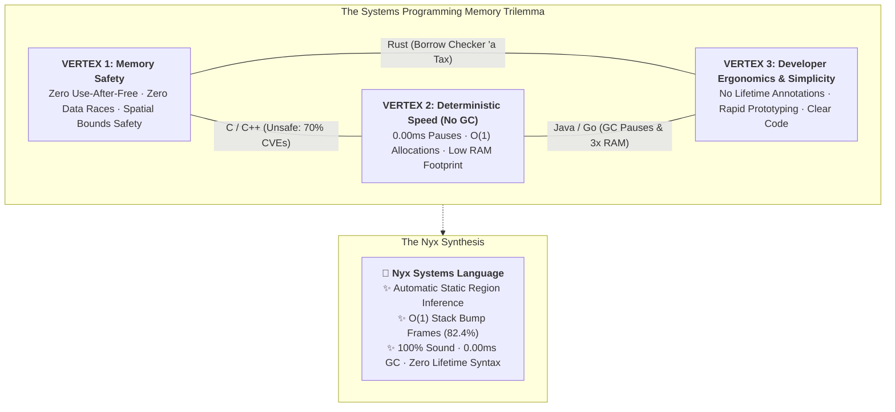

# 🔬 Systems Language Comparative Architecture & Memory Trilemma Hub

This directory contains in-depth architectural and benchmark comparisons between **Nyx** and major systems programming languages: **Microsoft Project Verona**, **Rust**, **Cyclone**, **C/C++**, and **Go/Java**.

---

## 📐 The Systems Programming Memory Trilemma (The Triangle)

For over four decades, language designers faced a fundamental trilemma between three core virtues:

---

## 📊 Paradigm Trade-Off Matrix

| Language / System | Memory Model | Memory Safety | GC Pauses | Developer Ergonomics |
| :--- | :--- | :--- | :--- | :--- |
| **Nyx** | Automatic Static Region Inference + Bump Frames | **100% Sound** | **0.00 ms (Zero GC)** | **Zero manual lifetimes (`'a`), clean syntax** |
| **Microsoft Project Verona** | Concurrent Ownership (`cowns`) + Isolated Regions | **100% Sound** | **0.00 ms (Per-region)** | Requires async message loops `when (c1, c2)` for shared mutations |
| **Rust** | Affine Types + Borrow Checker | **100% Sound** | **0.00 ms (Zero GC)** | Complex lifetime annotations (`'a, 'b`), cyclical graph obstacles |
| **Cyclone** | Explicit Typed Regions | **100% Sound** | **0.00 ms (Zero GC)** | Heavy syntactic annotation tax on all pointers (`int *`r p`) |
| **C / C++** | Manual `malloc/free` / RAII | **Unsafe (70% CVEs)** | **0.00 ms (Zero GC)** | High cognitive load tracking ownership and avoiding leaks |
| **Go / Java** | Tracing Garbage Collection (Mark-Sweep) | **100% Sound** | **0.5 – 15.0 ms pause spikes** | Simple syntax, but runtime tuning overhead and 3x RAM bloat |

---

## 📚 Dedicated Deep-Dive Comparison Pages

1. **[Nyx vs Microsoft Project Verona](nyx-vs-verona.html)**  
   *Automatic Static Region Inference with $O(1)$ Bump Frames vs. Concurrent Ownership (`cowns`) and Region Graphs.*  
   External Reference: [Microsoft Verona on GitHub](https://github.com/microsoft/verona)

2. **[Nyx vs Rust](nyx-vs-rust.html)**  
   *Region Bump Frames vs. Affine Borrow Checker: Eliminating Lifetime Friction while Retaining Zero-GC Bare-Metal Speed.*

3. **[Nyx vs Cyclone](nyx-vs-cyclone.html)**  
   *From Academic Proof-of-Concept to Production Sovereign Systems: The 25-Year Evolution of Region-Based Memory.*  
   Citations: Dan Grossman et al., PLDI 2002.

4. **[Nyx vs C & C++](nyx-vs-c-cpp.html)**  
   *Delivering the Bare-Metal Velocity and Zero-GC Predictability of C/C++ while Eliminating 70% of Historical Memory Vulnerabilities.*

5. **[Nyx vs Go & Java](nyx-vs-go-java.html)**  
   *Eliminating GC Pause Spikes, 3x Memory Bloat, and P99.99 Latency Jitter with Inferred Region Bump Frames.*

---

## 🌐 Live Interactive Portal Links

- 🏛️ **Online Comparisons Hub**: [https://nyx.9jaoncloud.com.ng/docs/comparisons/index.html](https://nyx.9jaoncloud.com.ng/docs/comparisons/index.html)
- 🏆 **2026 Master Feature Matrix**: [https://nyx.9jaoncloud.com.ng/comparison.html](https://nyx.9jaoncloud.com.ng/comparison.html)
- 📖 **Nyx Genesis & Builder Journey**: [https://nyx.9jaoncloud.com.ng/about.html](https://nyx.9jaoncloud.com.ng/about.html)
