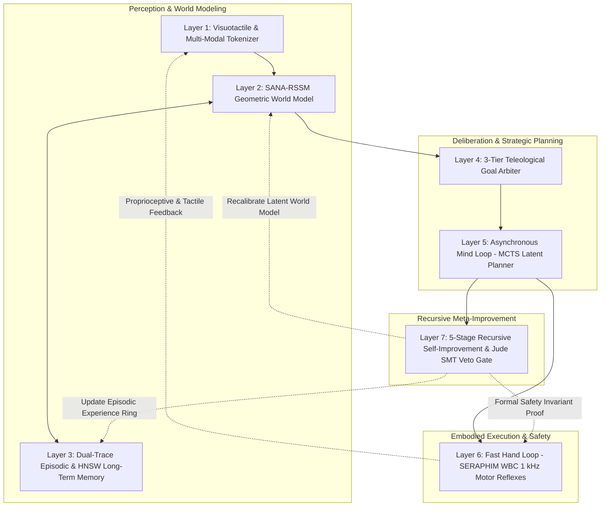

# Strategic Architectural Blueprint: Advancing Nyx SOPHIA via Frontiers in Embodied World Models & Recursive Self-Improvement

**Author:** Simeon Bala (9jaonCloud Engineering)  
**Classification:** Sovereign Applied AI Research & Architecture Specification  
**Subsystem:** Nyx SOPHIA (7-Layer Cognitive AGI) & SERAPHIM Robotics Bridge  
**Date:** September 2026  

---

## Executive Summary

To transition **Nyx SOPHIA** from an advanced reactive world-model substrate into a genuinely self-evolving, embodied General Intelligence, we have synthesized state-of-the-art breakthroughs from leading 2025–2026 Chinese and global AI research labs (including Tsinghua University, Shanghai AI Lab, Peking University, and Monica.im Manus AI).

This document establishes four concrete architectural upgrades to SOPHIA's 7-Layer Cognitive Architecture:
1. **Asynchronous Dual-Loop Mind-to-Hand Bridge** (*inspired by Manus AI [2505.02024]*).
2. **5-Stage Recursive Self-Improvement (RSI) Engine** (*inspired by Tsinghua University [2609.11873]*).
3. **Multimodal Scientific Verification & Protocol Alignment** (*inspired by ResearchClawBench [2606.07591]*).
4. **Visuotactile Differentiable World Model Arena** (*inspired by WorldArena 2.0 & SANA-WM [Shanghai AI Lab / PKU]*).

---

## 1. Deep Analysis of Reference Literature

### 1.1 Manus AI (*[arXiv:2505.02024]*: "From Mind to Machine: The Rise of Manus AI as a Fully Autonomous Digital Agent")
* **Core Insight:** Traditional LLMs suffer from a fatal disconnect between *reasoning* ("mind") and *execution* ("hand"). Manus AI bridges this by introducing a dual-engine architecture: a high-level cognitive planner that generates hierarchical intention graphs, paired with asynchronous sandboxed execution agents that iteratively validate environmental states, capture feedback, and self-correct before committing real-world actions.
* **SOPHIA Integration:** Decouple SOPHIA's Layer 5 (Latent MCTS Planner) and Layer 6 (SERAPHIM WBC Action Engine) into an asynchronous dual-rate execution model:
  - **Fast Hand Loop (1,000 Hz):** Rigid real-time motor and sensor reflexes in strict $O(1)$ bump arena memory.
  - **Deep Mind Loop (50 Hz):** Asynchronous RSSM latent imagination, counterfactual validation, and goal arbitration running across lock-free work-stealing threads.

### 1.2 Recursive Self-Improvement (*[arXiv:2609.11873]*: "The Last AI Built by Humans: Toward Genuine Recursive Self-Improvement")
* **Core Insight:** Tsinghua University identifies the *Headroom-Closed Index (HCI)*, proving that standard static pre-trained LLMs saturate rapidly without persistent experiential learning loops. Genuine AGI requires a 5-tier roadmap:
  1. *Improvement-Execution Autonomy:* Self-executing localized optimization.
  2. *Improvement-Strategy Autonomy:* Dynamic generation of learning curricula.
  3. *Experience-Acquisition Autonomy:* Active exploration to seek unrepresented edge-case data.
  4. *Environment-Adaptation Autonomy:* Rapid sim-to-real transfer and domain calibration.
  5. *Recursive Meta-Improvement:* Self-modification of the learning algorithms themselves.
* **SOPHIA Integration:** Upgrade SOPHIA's Layer 7 (Meta-Cognitive Reflection) to implement this 5-stage RSI pipeline, storing experiential delta weights in the dual-trace episodic memory.

### 1.3 ResearchClawBench (*[arXiv:2606.07591]*: "Benchmark for End-to-End Autonomous Scientific Research")
* **Core Insight:** Auto-research agents fail primarily due to three pathologies: *experimental protocol mismatch*, *evidence mismatch*, and *missing scientific core*. Multi-modal weighted rubrics are required to evaluate whether an agent's hypotheses and actions are genuinely grounded in reality.
* **SOPHIA Integration:** Embed Jude SMT mathematical verification into SOPHIA's hypothesis generation, ensuring zero hallucination of physical invariants.

### 1.4 Embodied World Model Frontiers (*Tsinghua WorldArena 2.0, Shanghai AI Lab SIM1/SANA-WM, PKU OpenWorldLib*)
* **Core Insight:** Scaling embodied intelligence requires moving beyond vision-only tokenizers to *visuotactile geometric world models* with differentiable physics alignment.
* **SOPHIA Integration:** Expand Layer 1 (Perception Tokenizer) to ingest high-frequency tactile, 6-DOF force-torque, and spatial IMU streams into a unified latent representation.

---

## 2. The Upgraded 7-Layer SOPHIA Cognitive Architecture

---

## 3. Implementation Roadmap for Nyx SOPHIA v2.0

1. **Visuotactile Tokenizer Bridge (`projects/sophia/sensors/visuotactile.nyx`)**:
   - Merge 100 Hz depth cameras, 1 kHz EtherCAT joint encoders, and 500 Hz tactile fingertip arrays into a continuous 256-dimensional spatial embedding.
2. **Asynchronous Manus-Style Sandboxed Planner (`projects/sophia/mind/dual_loop.nyx`)**:
   - Implement asynchronous MCTS rollout threads with zero lock contention using Nyx's lock-free ring buffers (`std.concurrency.ring_buffer`).
3. **5-Stage Recursive Self-Improvement Engine (`projects/sophia/meta/rsi_engine.nyx`)**:
   - Implement autonomous experience acquisition: When epistemic uncertainty $\sigma^2 > \theta_{\text{explore}}$, SOPHIA autonomously schedules exploratory actions to resolve model ambiguities.
4. **Jude SMT Cryptographic Certification**:
   - All self-improvement policy updates must pass compile-time and runtime Z3 safety proofs (`.jude.cert`) before execution on physical humanoid hardware.

---

## Conclusion

By grounding Nyx SOPHIA in sound region-inferred systems performance ($0.00\text{ ms}$ GC, $O(1)$ memory arenas) while integrating the latest breakthroughs in **Manus dual-loop agency**, **Tsinghua 5-stage RSI**, and **visuotactile embodied world models**, Nyx establishes a sovereign, mathematically certified frontier in artificial general intelligence.
